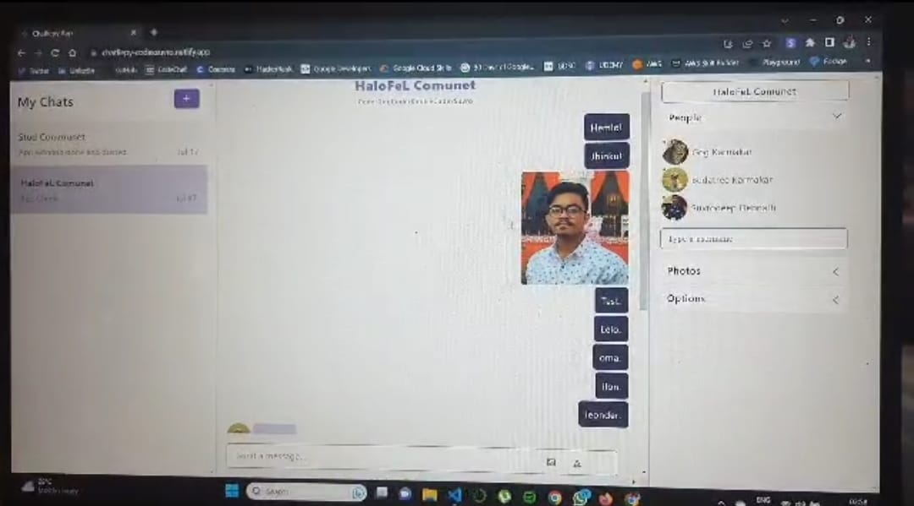

# Chatliepy-bulk-community-chatting-media




Welcome to our Real-Time Bulk Community Chatting App! This application is built using React and Next.js, styled with Ant Design, and powered by ChatEngine.io to provide a seamless and interactive chatting experience for large communities.

## Features

- **Real-Time Messaging:** Experience instant messaging with real-time updates, ensuring smooth communication between users within the community.

- **Bulk Chatting:** Engage in group discussions effortlessly with the ability to send messages to the entire community at once.

- **User Profiles:** Create personalized user profiles with avatars and status messages to add a personal touch to your interactions.

- **Emojis and Reactions:** Express yourself better with a wide range of emojis and reactions to choose from.

- **Moderation Tools:** Keep your community safe and enjoyable with built-in moderation tools to manage users and content.

- **Responsive Design:** Our app is fully responsive and works seamlessly on various devices, making it easy to chat on the go.

## Technologies Used

- **React and Next.js:** Utilizing the power of these modern JavaScript frameworks, our app delivers a smooth, interactive, and fast user experience.

- **Ant Design:** The stylish and customizable UI components from Ant Design ensure an appealing and consistent look throughout the application.

- **ChatEngine.io:** The ChatEngine.io platform provides the backend infrastructure for real-time chat functionality, allowing users to communicate without any delay.

## How to Use

1. Clone the repository to your local machine.

```
git clone https://github.com/your-username/real-time-bulk-community-chat.git
```

2. Navigate to the project directory.

```
cd real-time-bulk-community-chat
```

3. Install the dependencies.

```
npm install
```

4. Obtain your ChatEngine.io API credentials and replace them in the appropriate configuration file.

5. Run the development server.

```
npm run dev
```

6. Open your browser and visit `http://localhost:3000` to access the application.

## Contribution

We welcome contributions from the community to enhance the app's functionality and improve user experience. Feel free to raise issues, submit pull requests, and collaborate with us to make this app even better!

---

Ready to connect with your community in real-time? Join us and start chatting now! If you encounter any issues or have any questions, please don't hesitate to reach out to us.

Let's chat together and build a thriving community! 🎉✨
